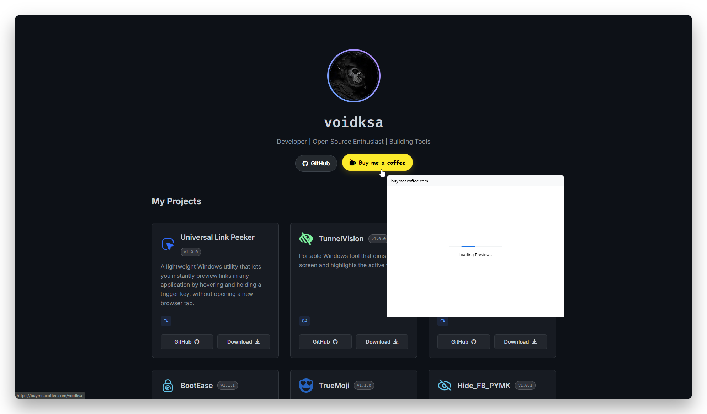

  

  # Universal Link Peeker

  
  

  **Universal Link Peeker redefines how you interact with links on Windows. Preview any URL instantly without opening a browser tab, simply by holding a trigger key.**

   
  
   

## ✨ Key Features

- **🚀 Instant Preview**: Hover over any link (in any application: Chrome, Discord, VS Code, Word, etc.) and hold your activation key to peek.
- **🛡️ Security First**: Built-in protection blocks automatic file downloads (`.exe`, `.zip`) and popup windows to keep your system safe.
- **📜 Seamless Scrolling**: Use your mouse wheel to scroll through the previewed page naturally.
- **📋 Quick Copy**: Press `C` while previewing to instantly copy the URL to your clipboard.
- **⚙️ Configurable**: Choose your preferred trigger key (`Shift`, `Ctrl`, or `Alt`) from the system tray menu.
- **🎯 Smart Positioning**: The preview window intelligently positions itself near your cursor while staying fully visible on screen.

## 📥 Installation

1. Download the latest release from the Releases page: [Latest Release](https://github.com/voidksa/UniversalLinkPeeker/releases/latest).
2. Extract the ZIP file to any folder.
3. Run `UniversalLinkPeeker.exe`.

> **Note**: Requires [WebView2 Runtime](https://developer.microsoft.com/en-us/microsoft-edge/webview2/) (pre-installed on Windows 10/11).

## 🎮 Usage

1. **Launch**: Run the app; it sits quietly in your system tray.
2. **Hover**: Move your mouse over any link.
3. **Peek**: Hold **Shift** (default) to open the preview.
4. **Interact**: 
   - **Scroll**: Use mouse wheel.
   - **Copy**: Press `C`.
5. **Dismiss**: Release the key to close.

## ⚙️ Configuration

Right-click the system tray icon to:
- Change Trigger Key (`Shift` / `Ctrl` / `Alt`).
- Exit the application.

## 📄 License

This project is licensed under the **MIT License** - see the [LICENSE](LICENSE) file for details.
You are free to use, modify, and distribute this software while preserving the copyright notice.
